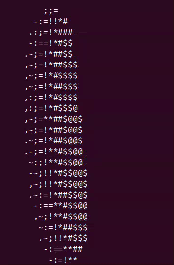

# Spinning Donut in terminal

This is a python implementation of this spinning donut in terminal.

## Reference
I learn about this from this [article](https://www.a1k0n.net/2011/07/20/donut-math.html) by Andy Sloane